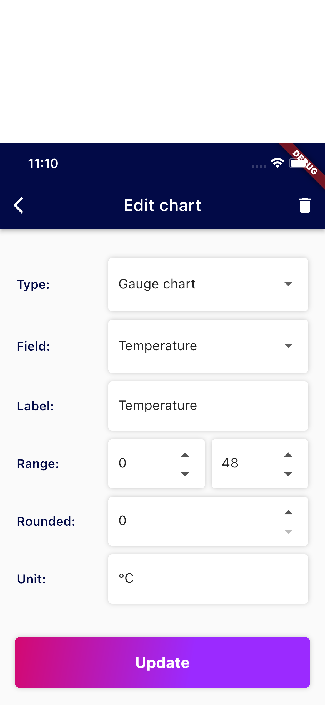
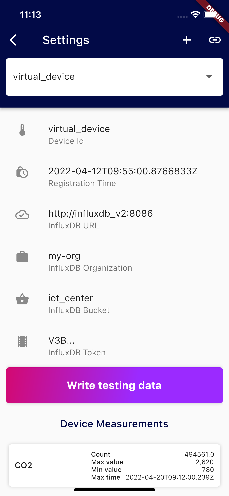

<div style="max-width: 1200px; min-width: 600px; font-size: 18px; margin: auto; padding: 50px;">

<h1>IoT Center <a style="color: #d30971 !important;"> Demo.</a> Build on <a style="color: #d30971 !important;"> InfluxDB.</a></h1>

This demo was designed to display data from Devices connected to IoT Center. Application is using InfluxDB v2 to store 
the data, Telegraf, Iot Center Demo and MQTT.


## Features

- data visualizations in gauge or simple chart
- editable charts parameters
- customizable dashboard - adding and deleting charts
- displaying device info and measurements
- write testing data
- automatic registration of devices in InfluxDB

## Getting Started

### Prerequisites
- Flutter - [Install Flutter](https://docs.flutter.dev/get-started/install), 
[online documentation](https://flutter.dev/docs)
- Docker - [Get started with docker](https://www.docker.com/get-started)
- IoT Center v2 with following ports - [IotCenter on GitHub](https://github.com/bonitoo-io/iot-center-v2)
    - 1883 (mqtt broker)
    - 8086 (influxdb 2.0 OSS)
    - 5000 (IoT center)
    
For start of the latest version IoT Center you can use:
```bash
docker-compose up
open http://localhost:5000
```

### Device Registration

On [IoT Center](http://localhost:5000/) go to [Device Registrations](http://localhost:5000/devices) and click Register
to add a new device. Enter device id "virtual_device" and click to Register for create.


 
## Run Application


### Home page

#### AppBar
App bar on this screen contains basic functions:

- 
/


display/hide buttons for charts editing and add new chart button
- 
   
refresh all charts
- 
  settings page with device info and 
IoT Center url settings 

On appbar drop down lists you can change device and time range for displaying data. After select device/time range
are data automatically refreshed.

#### Charts ListView
Charts ListView is scrollable and contains two different types of charts - gauge and simple.
- Gauge chart display average of all values in selected time range
```sql
import "influxdata/influxdb/v1"
    from(bucket: "${_client.bucket}")
        |> range(start: $maxPastTime)
        |> filter(fn: (r) => r.clientId == "${_config.id}" 
                    and r._measurement == "environment" 
                    and r["_field"] == "$field")
        |> mean()
```
- Simple chart display average data for aggregate window
```sql
import "influxdata/influxdb/v1"
    from(bucket: "${_client.bucket}")
        |> range(start: $maxPastTime)
        |> filter(fn: (r) => r.clientId == "${_config.id}" 
                    and r._measurement == "environment" 
                    and r["_field"] == "$field")
        |> keep(columns: ["_value", "_time"])
        |> aggregateWindow(column: "_value", every: $aggregate, fn: mean)
```


#### Edit Chart & New Chart

Each chart in Charts ListView contains 
 button (after unlock editing in AppBar). 
By clicking it, Edit Chart page is displayed. New chart page is showed after clicking `floatingActionButton` on Home page.

On Edit chart page, chart can be deleted by clicking on 
 in AppBar and after confirmation dialog.

DropDown list `Field:` gets values from influx by following query:
```sql
import "influxdata/influxdb/schema"
    schema.fieldKeys(
        bucket: "${_client.bucket}",
        predicate: (r) => r["_measurement"] == "environment" 
                      and r["clientId"] == "${_config.id}")
```
After updating/creating chart are data automatically refreshed (only for updated/created chart, other charts 
aren't affected).

**All changes in dashboard** - like add, delete and edit charts, are saved to system preferences after finish editing by 
clicking 
 on Dashboard Page AppBar.



### Settings page

#### AppBar
App bar on this screen contains basic functions:

- 
  
  add new device
- 
  
  change IoT Center url (save to system preferences)

#### Device Configuration

Device Configuration gets data from **IoT Center**. When selected device in AppBar DropDownList is changed, data is 
automatically refreshed.

Button **Write testing data** writes data to selected device for last 30 days. Data are generated for every minute.

#### Device Measurements

Device Measurements contains basic metrics for each field of selected Device for last 7 days. It's use following query:
```sql
import "math"
    from(bucket: "${_client.bucket}")
        |> range(start: -7d)
        |> filter(fn: (r) => r._measurement == "environment")
        |> filter(fn: (r) => r.clientId == "${_config.id}")
        |> toFloat()
        |> group(columns: ["_field"])
        |> reduce(
            fn: (r, accumulator) => ({
                maxTime: (if r._time>accumulator.maxTime then r._time 
                    else accumulator.maxTime),
                maxValue: (if r._value>accumulator.maxValue then r._value 
                    else accumulator.maxValue),
                minValue: (if r._value<accumulator.minValue then r._value 
                    else accumulator.minValue),
                count: accumulator.count + 1.0
            }),
            identity: {maxTime: 1970-01-01, count: 0.0, 
            minValue: math.mInf(sign: 1), 
            maxValue: math.mInf(sign: -1)}
        )
```


<br clear="right"/>


</div>

