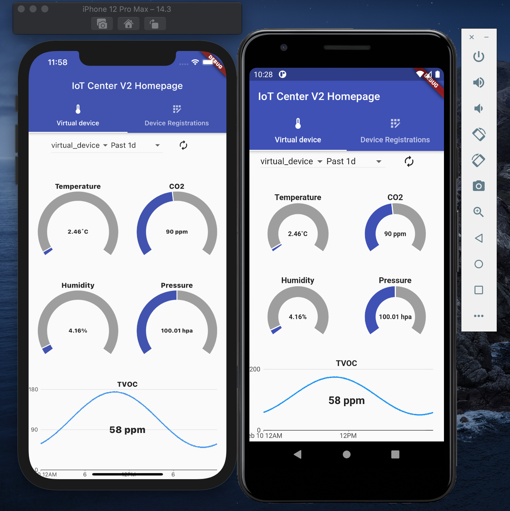

# Flutter Demo with InfluxDB

## Getting Started

This project is a starting point for a Flutter application with InfluxDB 2.0.

A few resources to get you started if this is your first Flutter project:

- [Lab: Write your first Flutter app](https://flutter.dev/docs/get-started/codelab)
- [Cookbook: Useful Flutter samples](https://flutter.dev/docs/cookbook)

For help getting started with Flutter, view our
[online documentation](https://flutter.dev/docs), which offers tutorials,
samples, guidance on mobile development, and a full API reference.


## How to run the Demo



### Install InfluxDB 2.0 in docker

 `docker run --publish 8086:8086 quay.io/influxdb/influxdb:v2.0.4`

### Initialize database
```
curl -i -X POST http://localhost:8086/api/v2/setup -H 'accept: application/json' \
    -d '{
            "username": "my-user",
            "password": "my-password",
            "org": "my-org",
            "bucket": "my-bucket",
            "token": "my-token"
        }'
```

### Create "iot_center" bucket

### Install and run IoT Centre v2 demo

In separate directory run: 
```
git clone git@github.com:bonitoo-io/iot-center-v2.git
cd  iot-center-v2
yarn build
yarn start
```

### Initialize IoT Center demo
open browser `http://localhost:5000/devices/virtual_device`

### Run flutter application 
```flutter run```

