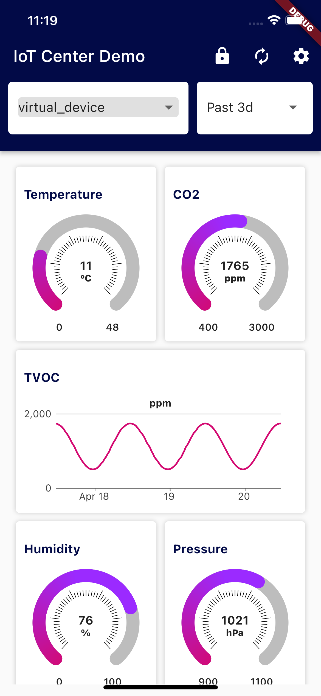
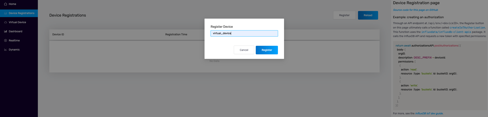
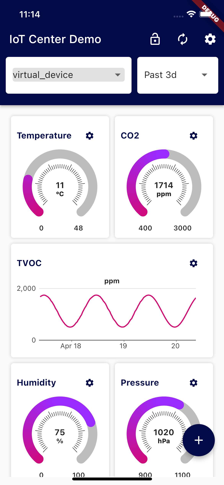

<div style="max-width: 1200px; min-width: 600px; font-size: 18px; margin: auto; padding: 50px; color: white;">


# IoT Center <a style="color: #d30971 !important;"> Demo.</a> Build on  <span style="color: #d30971;"> InfluxDB.</span>

This demo was designed to display data from Devices connected to IoT Center. Application is using InfluxDB v2 to store 
the data, Telegraf, Iot Center Demo and MQTT.




## Features

- data visualizations in gauge or simple chart
- editable charts parameters
- customizable dashboard - adding and deleting charts
- displaying device info and measurements
- write testing data
- automatic registration of devices in InfluxDB

## Getting Started

### Prerequisites
- Flutter - [Install Flutter](https://docs.flutter.dev/get-started/install), 
[online documentation](https://flutter.dev/docs)
- Docker - [Get started with docker](https://www.docker.com/get-started)
- IoT Center v2 with following ports - [IotCenter on GitHub](https://github.com/bonitoo-io/iot-center-v2)
    - 1883 (mqtt broker)
    - 8086 (influxdb 2.0 OSS)
    - 5000, 3000 nodejs server and UI app
    
For start of the latest version IoT Center you can use:
```bash
docker-compose up
open http://localhost:5000
```

### Device Registration

On [IoT Center](http://localhost:5000/) go to [Device Registrations](http://localhost:5000/devices) and click Register
to add a new device. Enter device id "virtual_device" and click to Register for create.



 
## Run Application



### Dashboard page

#### AppBar
App bar on this screen contains basic functions:

- 
/


display/hide buttons for charts editing and add new chart button
- 
   
refresh all charts
- 
  settings page with device info and 
IoT Center url settings 

On appbar drop down lists you can change device and time range for displaying data. After select device/time range
are data automatically refreshed.

#### Charts ListView


### Settings page


### Add chart page

<br clear="right"/>


</div>

