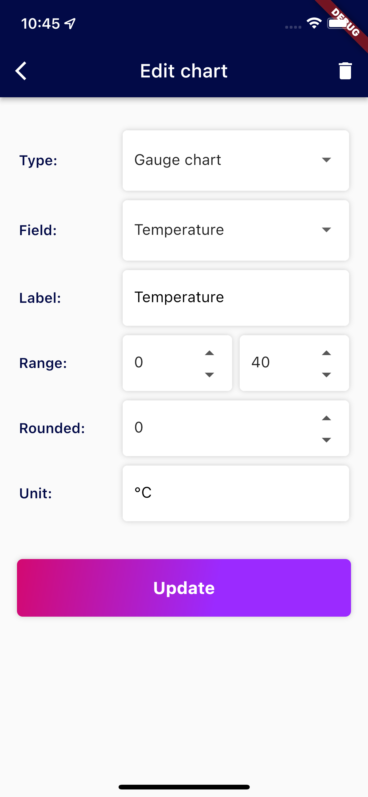

<div style="max-width: 1200px; min-width: 600px; font-size: 18px; margin: auto; padding: 50px;">


<h1>IoT Center <a style="color: #d30971 !important;"> Demo v2.</a> Build on <a style="color: #d30971 !important;"> InfluxDB.</a></h1>

This demo was designed to display data from Devices connected to IoT Center. Application is using InfluxDB v2 to store 
the data, Telegraf and MQTT.


## Features

### Devices
- device registration in InfluxDB
- two types of device - virtual and mobile
- remove device from InfluxDB
- remove associated device data
- displaying device info and measurements
- data visualizations in gauge or simple chart
- can use different dashboards for one device
- write testing data to InfluxDB for virtual device
- write sensor data to InfluxDB for mobile device

### Dashboards
- dashboard registration in InfluxDB
- two types of dashboards - virtual or mobile
- pair dashboard with device
- editable charts parameters
- customizable - adding and deleting charts


## Getting Started

### Prerequisites
- Flutter - [Install Flutter](https://docs.flutter.dev/get-started/install), 
[online documentation](https://flutter.dev/docs)
- Docker - [Get started with docker](https://www.docker.com/get-started)
- **InfluxDB** with mosquitto and telegraf 
  - you need following ports: 
      - **1883** (mqtt broker)
      - **8086** (influxdb 2.0 OSS)
  - for start use docker-compose.yaml:
    ```bash
    docker-compose up
    ```

## Run Application


### Home page

Home page contains device `ListView`.

#### AppBar
App bar on this screen contains basic functions:

- 
  
  add new device
- 
   
refresh devices
- 
  settings page 

#### Device ListView
Each device tile contains DeviceId and following actions:

-  for deleting device
- 
    
    go to device page


#### Add Device

To `TextBox` enter device id, in `DropDownList` select type of device and click to Save for create. Device is automatically 
registered in InfluxDB - it's write as point via `WriteService` with its authorization.

Example of creating device point in InfluxDB - [createDevice](/lib/src/app/model/influx_model.dart#L525):
```dart
var writeApi = _influxDBClient.getWriteService();
var point = Point('deviceauth')
          .addTag('deviceId', deviceId)
          .addField('key', authorization.id)
          .addField('token', authorization.token);
writeApi.write(point);
```

Creating device IoT authorization via `AuthorizationsApi` - [_createIoTAuthorization](/lib/src/app/model/influx_model.dart#L593):
```dart
var authorizationApi = _influxDBClient.getAuthorizationsApi();
var permissions = [
  Permission(
          action: PermissionActionEnum.read,
          resource: Resource(
                  type: ResourceTypeEnum.buckets,
                  id: bucketId,
                  orgID: orgId,
                  org: org)),
  Permission(
          action: PermissionActionEnum.write,
          resource: Resource(
                  type: ResourceTypeEnum.buckets,
                  id: bucketId,
                  orgID: orgId,
                  org: org)),
];
AuthorizationPostRequest request = AuthorizationPostRequest(
        orgID: orgId,
        description: 'IoTCenterDevice: ' + deviceId,
        permissions: permissions);

authorizationApi.postAuthorizations(request);
```


#### Refresh Devices

Reload active devices (`_value` field cannot be empty) from InfluxDB using `QueryService` with following query - 
[fetchDevices](/lib/src/app/model/influx_model.dart#L94):
```sql
from(bucket: "${_influxDBClient.bucket}")
    |> range(start: -30d)
    |> filter(fn: (r) => r["_measurement"] == "deviceauth"
                     and r["_field"] == "key")
    |> last()
    |> filter(fn: (r) => r["_value"] != "")
```


#### Delete Device

On each tile of device is  
for deleting device. After clicking on it, there is confirmation dialog with `CheckBox` for choose deleting 
device with associated data - if it's checked, data are deleted too.

Example of deleting data via `DeleteService` - [deleteDevice](/lib/src/app/model/influx_model.dart#L644):
```dart
var deleteApi = _influxDBClient.getDeleteService();
if (deleteWithData) {
    await deleteApi.delete(
          predicate: 'clientId="$deviceId"',
          start: DateTime(1970).toUtc(),
          stop: DateTime.now().toUtc(),
          bucket: _influxDBClient.bucket,
          org: _influxDBClient.org);
}
```

After deleting device **isn't** remove from InfluxDB - in this case **deleting** is meaning **removing of device
authorization** and **IoT Authorization**.

Removed device has in InfluxDB empty fields `key` and `token`, it means, that device authorization was removed via 
`WriteService`- [_removeDeviceAuthorization](/lib/src/app/model/influx_model.dart#L674):
```dart
var writeApi = _influxDBClient.getWriteService();
var point = Point('deviceauth')
          .addTag('deviceId', deviceId)
          .addField('key', '')
          .addField('token', '');
writeApi.write(point);
```

IoT Authorization is also removed, in this case `AuthorizationsApi` is used - [_deleteIoTAuthorization](/lib/src/app/model/influx_model.dart#L715):
```dart
 var authorizationApi = _influxDBClient.getAuthorizationsApi();
 authorizationApi.deleteAuthorizationsID(key);
```


### Settings Page

#### Dashboards

Dashboard tab contains `ListView` of all Dashboards stored in InfluxDB, with associated devices. 
It uses `QueryService` to load data - [fetchDashboards](/lib/src/app/model/influx_model.dart#L202):

```sql
from(bucket: "${_influxDBClient.bucket}")
    |> range(start: -30d)
    |> filter(fn: (r) => r["_measurement"] == "$measurementDashboardFlutter")
    |> last()
```

For loading associated devices is use `QueryService` for each dashboard (identify by `dashboardKey`) - 
[fetchDashboardDevices](/lib/src/app/model/influx_model.dart#L315):
```sql
from(bucket: "${_influxDBClient.bucket}") 
    |> range(start: 0) 
    |> filter(fn: (r) => r._measurement == "deviceauth")
    |> filter(fn: (r) => r._field == "dashboardKey")
    |> last()
    |> filter(fn: (r) => r._value == "$dashboardKey")
```


App bar on this tab has this functions:

- 
  
  add new dashboard
- 
  
  refresh dashboards

After clicking **add new device** button dialog is shown - to `TextBox` enter dashboard id, in `DropDownList` select 
type of dashboard and click to Save for create. Dashboard is automatically registered in InfluxDB - it's write as 
point via `WriteService`.

Example of creating dashboard point in InfluxDB - [createDashboard](/lib/src/app/model/influx_model.dart#L347):
```dart
var writeApi = _influxDBClient.getWriteService();
var point = Point(measurementDashboardFlutter)
        .addTag("key", key)
        .addTag("deviceType", deviceType)
        .addField("data", dashboardData);
writeApi.write(point);
```


#### Sensors


#### Influx settings

This tab stored credentials for InfluxDB connection. Those credentials are saved locally in `SharedPreferences`.

App bar on this tab has this functions:

- 
  /
  
  
  enable/disable editing 

Loading is in method [loadInfluxClient](/lib/src/app/model/influx_client.dart#L27):
```dart
var prefs = await SharedPreferences.getInstance();
if (prefs.containsKey("influxClient")) {
  _fromJson(json.decode(prefs.getString("influxClient")!));
}
```

Save credentials is allowed only in editable mode. Method for save is [saveInfluxClient](/lib/src/app/model/influx_client.dart#L40):
```dart
SharedPreferences prefs = await SharedPreferences.getInstance();
prefs.setString("influxClient", jsonEncode(this));
```


### Device Detail Page

#### Dashboard

Dashboard tab contains chart ListView - it's scrollable and contains two different types of charts - gauge and simple.
Both charts use `QueryService` to get data - [fetchDeviceDataField](/lib/src/app/model/influx_model.dart#L732)
- Gauge chart display average of all values in selected time range
```sql
import "influxdata/influxdb/v1"
    from(bucket: "${_client.bucket}")
        |> range(start: $maxPastTime)
        |> filter(fn: (r) => r.clientId == "${_config.id}" 
                    and r._measurement == "environment" 
                    and r["_field"] == "$field")
        |> mean()
```
- Simple chart display average data for aggregate window
```sql
import "influxdata/influxdb/v1"
    from(bucket: "${_client.bucket}")
        |> range(start: $maxPastTime)
        |> filter(fn: (r) => r.clientId == "${_config.id}" 
                    and r._measurement == "environment" 
                    and r["_field"] == "$field")
        |> keep(columns: ["_value", "_time"])
        |> aggregateWindow(column: "_value", every: $aggregate, fn: mean)
```


App bar on this tab (in non-editable mode) contains:

- "-1h" `TextButton` with selected time range
- 
  
  refresh charts
- 
   turn on editable mode - display/hide
buttons for editing on chart tiles and `FloatingActionButton` button for add new chart.

App bar on this tab (in editable mode) contains:

- 
   change dashboard
- 
 turn off editable mode, save changes to 
dashboard in InfluxDB

Button 'change dashboard' open dialog with `DropDownMenu` - for getting dashboards is use `QueryService`, where are 
dashboards filtered by device type - [fetchDashboardsByType](/lib/src/app/model/influx_model.dart#L230):
```sql
from(bucket: "${_influxDBClient.bucket}")
    |> range(start: -30d)
    |> filter(fn: (r) => r["_measurement"] == "$measurementDashboardFlutter")
    |> filter(fn: (r) => r["deviceType"] == "$deviceType")
    |> last()
```


After selecting dashboard and clicking 'Save' is dashboard associated to device. New point is created and write to
InfluxDB by `WriteService` - [pairDeviceDashboard](/lib/src/app/model/influx_model.dart#L384):
```dart
var writeApi = _influxDBClient.getWriteService();
var point = Point('deviceauth')
        .addTag('deviceId', deviceId)
        .addField('dashboardKey', dashboardKey);
writeApi.write(point);
```
In 'change dashboard' dialog new dashboard can be created - after clicking 'New' is open another dialog with `TextBox`
for DashboardKey. The type of dashboard created in Device Detail page is the same as current device. Empty dashboard is saved to
InfluxDB by `WriteService` - [createDashboard](/lib/src/app/model/influx_model.dart#L347):


```dart
var writeApi = _influxDBClient.getWriteService();
var point = Point(measurementDashboardFlutter)
        .addTag("key", key)
        .addTag("deviceType", deviceType)
        .addField("data", dashboardData);
writeApi.write(point);
```
After creating new dashboard, dialog for changing dashboard is showing again and in `DropDownList` is preselected 
newly created dashboard. Association to device is created after clicking 'Save'.

**Each dashboard can be customized** (in editable mode):
- adding new charts - by clicking on `FloatingActionButton` is 'New Chart Page' open
- editing charts - on each chart tile is 
   button, which open 'Edit Chart Page'
- delete chart - chart can be deleted on 'Edit Chart Page'

Changes on dashboard are saved to InfluxDB after clicking 
 button and editable mode is turned off.


#### Device Detail

This page contains basic device information. For getting them is use method 
[fetchDeviceWithDashboard](/lib/src/app/model/influx_model.dart#L193) - this method has two parts:
- get device info by `QueryService` - [fetchDevice](/lib/src/app/model/influx_model.dart#L129)
```sql
from(bucket: "${_influxDBClient.bucket}")
    |> range(start: -30d)
    |> filter(fn: (r) => r["_measurement"] == "deviceauth" 
                     and r.deviceId == "$deviceId")
    |> last()
```
- get dashboard by `QueryService` - [fetchDashboard](/lib/src/app/model/influx_model.dart#L261)
```sql
from(bucket: "${_influxDBClient.bucket}") 
    |> range(start: 0) 
    |> filter(fn: (r) => r._measurement == "$measurementDashboardFlutter")
    |> filter(fn: (r) => r.key == "$dashboardKey")
    |> filter(fn: (r) => r._field == "data")
    |> last()
```

App bar on this tab has this functions:

- 
  
  write emulated data to InfluxDB by `WriteService` - [writeEmulatedData](/lib/src/app/model/influx_model.dart#L793):
```dart
while (lastTime < toTime) {
  lastTime += 60000;
  var point = Point('environment');
  point
    .addTag('clientId', deviceId)
    .addField('Temperature', _generate(period: 30, min: 0, max: 40, time: lastTime))
    .addField('Humidity', _generate(period: 90, min: 0, max: 99, time: lastTime))
    .addField('Pressure', _generate(period: 20, min: 970, max: 1050, time: lastTime))
    .addField('CO2', _generate(period: 1, min: 400, max: 3000, time: lastTime).toInt())
    .addField('TVOC', _generate(period: 1, min: 250, max: 2000, time: lastTime).toInt())
    .addTag('TemperatureSensor', 'virtual_TemperatureSensor')
    .addTag('HumiditySensor', 'virtual_HumiditySensor')
    .addTag('PressureSensor', 'virtual_PressureSensor')
    .addTag('CO2Sensor', 'virtual_CO2Sensor')
    .addTag('TVOCSensor', 'virtual_TVOCSensor')
    .addTag('GPSSensor', 'virtual_GPSSensor')
    .time(lastTime);
  writeApi.batchWrite(point);
}
```


#### Measurements

Measurements tab contains `ListView` of basic metrics for each field of selected Device for last 30 days. It's use following
`QueryService` - [fetchMeasurements](/lib/src/app/model/influx_model.dart#L469):
```sql
deviceData = from(bucket: "${_influxDBClient.bucket}")
    |> range(start: -30d)
    |> filter(fn: (r) => r._measurement == "environment"
            and r.clientId == "$deviceId")
measurements = deviceData
    |> keep(columns: ["_field", "_value", "_time"])
    |> group(columns: ["_field"])
counts  =   measurements |> count()                
                         |> keep(columns: ["_field", "_value"]) 
                         |> rename(columns: {_value: "count"   })
maxValues = measurements |> max  ()  
                         |> toFloat()  
                         |> keep(columns: ["_field", "_value"]) 
                         |> rename(columns: {_value: "maxValue"})
minValues = measurements |> min  ()  
                         |> toFloat()  
                         |> keep(columns: ["_field", "_value"]) 
                         |> rename(columns: {_value: "minValue"})
maxTimes  = measurements |> max  (column: "_time") 
                         |> keep(columns: ["_field", "_time" ]) 
                         |> rename(columns: {_time : "maxTime" })

j = (tables=<-, t) => join(tables: {tables, t}, on:["_field"])

counts |> j(t: maxValues)
       |> j(t: minValues)
       |> j(t: maxTimes)
       |> yield(name: "measurements")
```

App bar on this tab contains:
- 
  
  refresh Measurements



### Edit Chart & New Chart Page

Each chart in Charts ListView contains 
 button (after unlock editing in AppBar) at 
Device Detail Page in tab Dashboard. By clicking it, Edit Chart page is displayed. 
New chart page is showed after clicking `floatingActionButton` on Device Detail Page in tab Dashboard.

On Edit chart page, chart can be deleted by clicking on 

 in AppBar and after confirmation dialog.

DropDown list `Field:` gets values from InfluxDB by `QueryService` - [fetchFieldNames](/lib/src/app/model/influx_model.dart#L437):
```sql
import "influxdata/influxdb/schema"
    schema.fieldKeys(
        bucket: "${_client.bucket}",
        predicate: (r) => r["_measurement"] == "environment" 
                      and r["clientId"] == "${_config.id}")

```
After updating/creating chart are data automatically refreshed (only for updated/created chart, other charts 
aren't affected).

<br clear="right"/>
</div>

